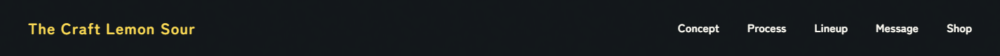
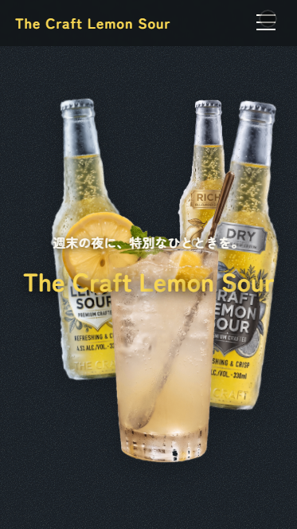
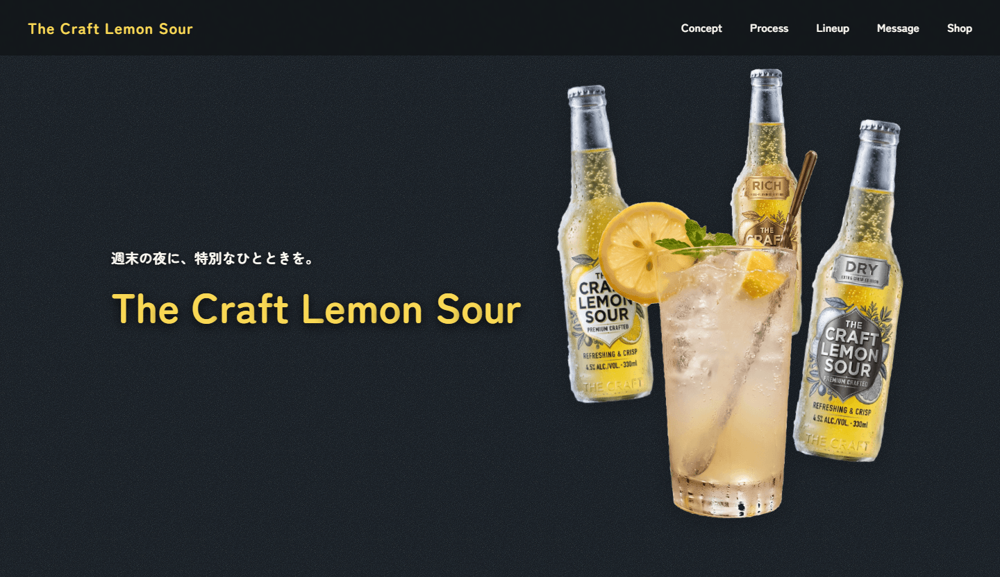
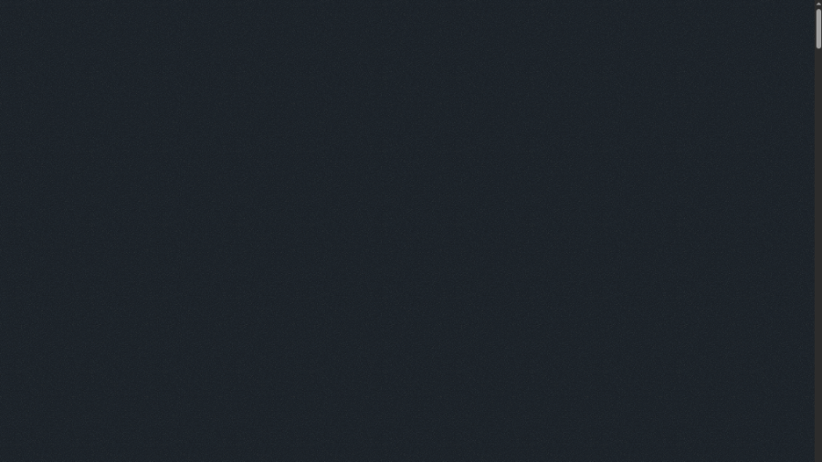
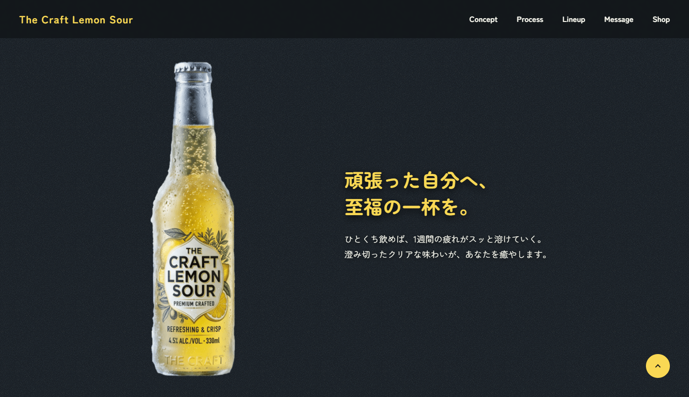
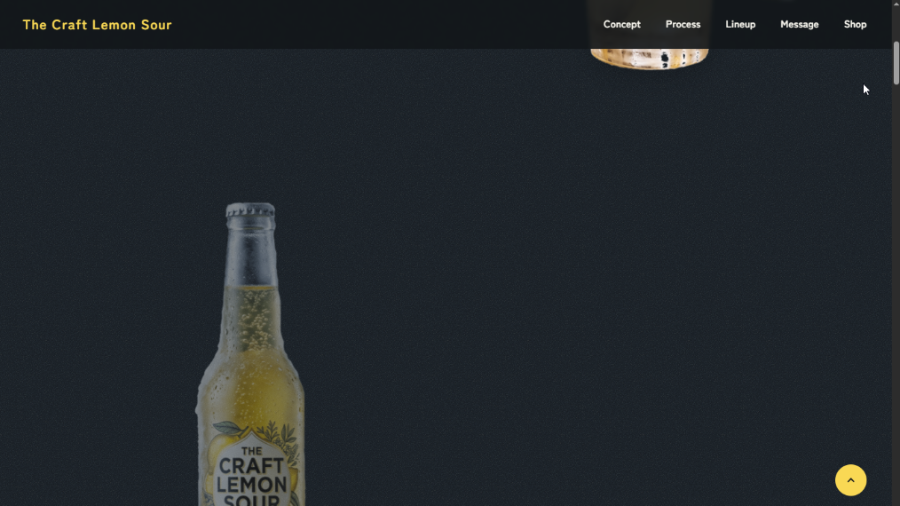
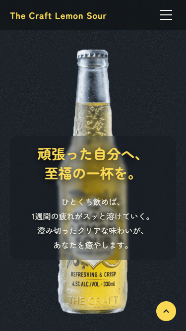

# The Craft Lemon Sour<!-- omit in toc -->

## 目次<!-- omit in toc -->
- [概要](#概要)
- [公開URL](#公開url)
- [目的](#目的)
- [こだわったポイント](#こだわったポイント)
- [使用技術](#使用技術)
- [使用フォント](#使用フォント)
- [各画面・機能紹介](#各画面機能紹介)
  - [背景レイヤー](#背景レイヤー)
  - [ヘッダー](#ヘッダー)
    - [SP時のハンバーガーメニュー制御](#sp時のハンバーガーメニュー制御)
    - [こだわりのスクロール＆リサイズ制御](#こだわりのスクロールリサイズ制御)
  - [FVセクション](#fvセクション)
    - [ローディング・実行順序](#ローディング実行順序)
    - [デバイスに応じた登場アニメーション](#デバイスに応じた登場アニメーション)
    - [2つのパララックス（視差効果）による奥行きの演出](#2つのパララックス視差効果による奥行きの演出)
  - [Conceptセクション](#conceptセクション)
    - [スクロール連動のPin留め（固定）アニメーション](#スクロール連動のpin留め固定アニメーション)
    - [テキストのブラー演出と視認性への配慮](#テキストのブラー演出と視認性への配慮)
  - [Processセクション](#processセクション)
  - [Lineupセクション](#lineupセクション)
  - [Messageセクション](#messageセクション)
  - [Shopセクション](#shopセクション)
  - [フッター](#フッター)
  - [トップへ戻るボタン](#トップへ戻るボタン)

## 概要
架空のクラフトレモンサワー「The Craft Lemon Sour」のプロモーションを目的としたLPです。

Viteをビルドツールとして採用し、FLOCSSベースのSCSS設計や、各セクション（コンポーネント）ごとに分割したJavaScriptモジュールの運用など、実務を強く意識したモダンなフロントエンド開発環境で制作しました。

特にGSAP（GreenSock Animation Platform）をフル活用し、ユーザーのスクロールや操作に連動するリッチで魅力的なUI/UXを実現しています。

## 公開URL
[https://craft-lemon-sour.mikanbako.jp/](https://craft-lemon-sour.mikanbako.jp/)

## 目的
コーダーおよびフロントエンドエンジニアとしての、自身のコーディングスキルと高度な実装力を証明するためのポートフォリオ作品として制作しました。
単なる静的なWebページ制作にとどまらず、以下のような実践的なスキルのアピールを目的としています。

* **高度なアニメーション実装力：**
  GSAPの ScrollTrigger などを駆使した、パララックス（視差効果）、要素のピン留めによる横スクロール、シームレスなローディング演出などの複雑なアニメーション制御。

* **保守性・拡張性の高いコード設計：**
  FLOCSSの概念を取り入れたCSSアーキテクチャや、モジュール化されたJavaScriptによる、チーム開発を見据えた綺麗なコードベースの構築。

* **モダンな開発環境の活用：**
  Viteを用いたスムーズな開発体験と、本番環境を見据えた最適なビルドプロセス（最適化・デプロイ）の実践。

## こだわったポイント
* **GSAPプラグインを駆使した、没入感のあるアニメーション実装**

  標準のGSAPに加え、ScrollTrigger、ScrollToPlugin、SplitTextといったプラグインを適材適所で活用しています。マウス連動パララックス（FVセクション）や、`containerAnimation` を用いた横スクロール（Lineupセクション）、PC環境限定のマグネティックボタン（Shopセクション）など、ユーザーの操作やスクロールに連動する、リッチで没入感のあるUXを追求しました。

* **GSAP matchMedia を用いた、デバイス最適化のアニメーション制御**

  レスポンシブ対応において、CSSによるレイアウト変更だけでなく、アニメーションの発火タイミングや順序もデバイスごとに最適化しています。GSAPの `matchMedia` を利用し、PC（横並びレイアウト）ではタイムラインによる連動したアニメーションを、SP（縦積みレイアウト）では個別のScrollTriggerによるアニメーションを出し分けるなど、どのデバイスでも違和感のない自然な動きを実現しました。

* **FLOCSSアーキテクチャに基づく、保守性の高いCSS設計**

  CSSの設計にはFLOCSSを採用し、レイアウト、プロジェクト、コンポーネントごとにSass (SCSS) ファイルを細かく分割して管理しています。特に `z-index` の管理においては、ヘッダーやハンバーガーメニューなどのグローバルに競合する値は [`_variables.scss`](src/scss/global/_variables.scss) で一元管理し、セクション内でのみ完結する重なり順は各SCSSファイル内に直接記述するルールを設けることで、破綻しにくく保守性の高いスタイル管理を実践しました。

* **機能ごとのJavaScriptモジュール化と、JSDocによるドキュメント化**

  [`main.js`](src/js/main.js) に全ての処理を記述するのではなく、ヘッダー機能や各セクションのアニメーションなど、機能単位でJavaScriptをモジュール化して分割しています。さらに、エクスポートする各初期化関数にはJSDocを用いて役割や引数・戻り値を明文化し、複数人でのチーム開発を想定した、可読性が高くメンテナンスしやすいコードベースを構築しました。

* **Vite + Stylelint を導入したモダンな開発・ビルド環境の構築**

  フロントエンドのビルドツールとしてViteを採用し、HMRによる高速な開発環境を構築しています。また、Stylelint（Recess Orderによるプロパティ順序の自動ソート含む）を導入し、保存時の自動フォーマット化によりコード品質を担保しています。公開に向けては、Viteによるファイルのバンドルと圧縮、Autoprefixerによるベンダープレフィックスの自動付与を行い、パフォーマンスを意識した最適なビルドプロセスを実践しました。

## 使用技術
**フロントエンド**
* HTML
* Sass (SCSS)
* JavaScript (ES Modules)
* GSAP (ScrollTrigger, ScrollToPlugin, SplitText)

**設計・開発環境**
* FLOCSS (CSSアーキテクチャ)
* Vite (ビルドツール)
* Node.js / npm (パッケージ管理)
* Stylelint (静的解析・コードフォーマッター)

**インフラ・その他**
* さくらVPS
* Apache (Webサーバー)
* Git / GitHub (バージョン管理)

## 使用フォント
* [Zen Maru Gothic](https://fonts.google.com/specimen/Zen+Maru+Gothic)
* [M PLUS Rounded 1c](https://fonts.google.com/specimen/M+PLUS+Rounded+1c)

## 各画面・機能紹介

本サイトの構成と、各セクションに実装している機能やこだわりポイントについて、実際の動き（webp動画）やスクリーンショットを交えながら紹介します。

### 背景レイヤー

サイト全体のベースとなる背景専用のレイヤーです。

`position: fixed` で画面全体に固定配置し、高さに `100lvh` を指定することで、スマートフォン環境におけるアドレスバーの開閉時にも背景の下部に隙間ができないよう工夫しています。

また、単なる単色のベタ塗りではなく、疑似要素（::before）を用いて[ノイズテクスチャの画像](src/assets/images/common/noise.jpg)を重ねています。`mix-blend-mode: color-dodge` を用いて白い粒立ちを際立たせ、適度な透過（`opacity: 0.12`）を適用することで、大人っぽさや高級感を引き立てるリッチな質感を演出しました。

※なお、このレイヤーは後述の「[Processセクション](#processセクション)」における、スクロールに連動した背景色切り替えのベース要素としても機能しています。

> 📂 **関連ファイル**
> * SCSS: [_bg.scss](src/scss/object/component/_bg.scss)

### ヘッダー

ページ上部に固定追従するヘッダーです。背景には `backdrop-filter: blur(3px)` を適用し、スクロール時に背後のコンテンツが透ける、すりガラス風のデザインを採用しています。

#### SP時のハンバーガーメニュー制御
スマートフォン表示時にはハンバーガーメニューを採用しています。メニューボタンのクリックに合わせて、GSAPのタイムライン（`gsap.timeline`）を用いて全画面の背景をフェードインさせつつ、ナビゲーションリンクを1つずつ時間差（`stagger`）で下からふわっと表示させるアニメーションを実装しました。メニュー展開時の背景エリアには `100lvh` を指定し、アドレスバーの開閉による画面下部の隙間やチラつきを防ぐスタイル設定を行っています。

#### こだわりのスクロール＆リサイズ制御
* **動的なスムーススクロール**
  GSAPの `ScrollToPlugin` を活用してページ内リンクのスムーススクロールを実装しています。移動先の座標を計算する際、`offsetY` に「クリックした瞬間の動的なヘッダーの高さ」を渡すことで、どのデバイスでもスクロール停止位置がヘッダーに隠れてしまうのを防いでいます。

* **リサイズ時の状態リセット**
  `window.matchMedia` を用いてブレイクポイント（`768px`）を監視しています。SPサイズでメニューを開いたままPCサイズにウィンドウを広げた際などは、瞬時にメニューを閉じ、GSAPが付与したインラインスタイルを自動でクリア（`clearProps: 'all'`）することで表示崩れを未然に防ぐ設計にしています。

> 📂 **関連ファイル**
> * JS: [header.js](src/js/modules/header.js)
> * SCSS: [_header.scss](src/scss/layout/_header.scss)

### FVセクション

サイト訪問者の目を最初に惹きつける、リッチなアニメーションを盛り込んだファーストビューです。FOUC（スタイル適用前のちらつき）を防ぐため、初期状態はSCSSで `visibility: hidden` と `opacity: 0` を設定し、GSAPで制御する設計にしています。

#### ローディング・実行順序
`main.js` 内で `window.addEventListener('load')` を用い、すべてのリソースの読み込み完了を待機しています。その後、サイト全体（`.l-wrapper`）をフェードインさせ、ヘッダーの降下アニメーション（`initHeader`）の完了を `await` で待ってからFVのアニメーション（`initFv`）を開始する、という実行順序を管理しています。

#### デバイスに応じた登場アニメーション
GSAPの `SplitText` プラグインを使用して、キャッチコピーとタイトルを1文字ずつ分割（`type: 'chars'`）しています。また、`matchMedia` を活用し、SP表示では下から上への縦方向、PC表示では左右からの横方向といった、画面幅に合わせた登場アニメーション（`stagger` による連続表示）を出し分けています。

#### 2つのパララックス（視差効果）による奥行きの演出
* **マウス追従パララックス**
  PC環境において `mousemove` イベントを取得し、カーソルの動きに合わせて各ボトルと主役のグラスが追従するアニメーションを実装しています。グラスは逆方向に動かし、ボトルは `data-speed` で移動量を変えることで自然な立体感を表現しました。

* **スクロール連動パララックス**
  `ScrollTrigger` を用いて、スクロール時に主役のグラスが拡大（`scale: 1.33`）しながら上部へ移動する演出を実装しています。奥のボトルも個別の速度で移動させることで、スクロールする楽しさを提供しています。

> 📂 **関連ファイル**
> * JS (初期化・実行順序): [main.js](src/js/main.js)
> * JS (FVアニメーション): [fv.js](src/js/modules/fv.js)
> * SCSS: [_fv.scss](src/scss/object/project/_fv.scss)

### Conceptセクション

商品の魅力や世界観を伝えるConceptセクションです。商品ボトルを画面内に固定（Pin留め）したまま、テキストがスクロールして流れていくレイアウトを実装しています。

#### スクロール連動のPin留め（固定）アニメーション
GSAPの `ScrollTrigger` を使用し、ボトル画像の固定表示を実現しています。

固定を開始する座標（`start`）は、JSで動的に取得したヘッダーの高さを加味（`top top+=${headerHeight}`）することで、ヘッダーの裏側に画像が隠れるのを防いでいます。

また、`matchMedia` を用いて、PC表示では横並びを維持するために `pinSpacing: true`、SP表示ではテキストを画像の上に被せるために `pinSpacing: false` を指定し、デバイスごとに最適なレイアウト変化を制御しています。

#### テキストのブラー演出と視認性への配慮
テキストブロックが画面内に入った際、GSAPのタイムラインで `filter: blur(8px)` から `0px` へ変化させながら、見出しと説明文を時間差（`stagger: 0.2`）でフェードインさせるという演出を取り入れています。

また、画像の上にテキストが重なるSP表示においては、SCSSでテキストブロックに `backdrop-filter: blur(0.3rem)` と半透明のダークネイビー背景を設定し、視認性の高いすりガラス風のスタイルを適用しています。

> 📂 **関連ファイル**
> * JS: [concept.js](src/js/modules/concept.js)
> * SCSS: [_concept.scss](src/scss/object/project/_concept.scss)

### Processセクション

>関連JSファイル: [process.js](src/js/modules/process.js)

>関連SCSSファイル: [_process.scss](src/scss/object/project/_process.scss)

### Lineupセクション

>関連JSファイル: [lineup.js](src/js/modules/lineup.js)

>関連SCSSファイル: [_lineup.scss](src/scss/object/project/_lineup.scss)

### Messageセクション

>関連JSファイル: [message.js](src/js/modules/message.js)

>関連SCSSファイル: [_message.scss](src/scss/object/project/_message.scss)

### Shopセクション

>関連JSファイル: [shop.js](src/js/modules/shop.js)

>関連SCSSファイル: [_shop.scss](src/scss/object/project/_shop.scss) / [_button.scss](src/scss/object/component/_button.scss)

### フッター

>関連JSファイル: [footer.js](src/js/modules/footer.js)

>関連SCSSファイル: [_footer.scss](src/scss/layout/_footer.scss)

### トップへ戻るボタン

>関連JSファイル: [common.js](src/js/modules/common.js)

>関連SCSSファイル: [_pagetop.scss](src/scss/object/component/_pagetop.scss)
